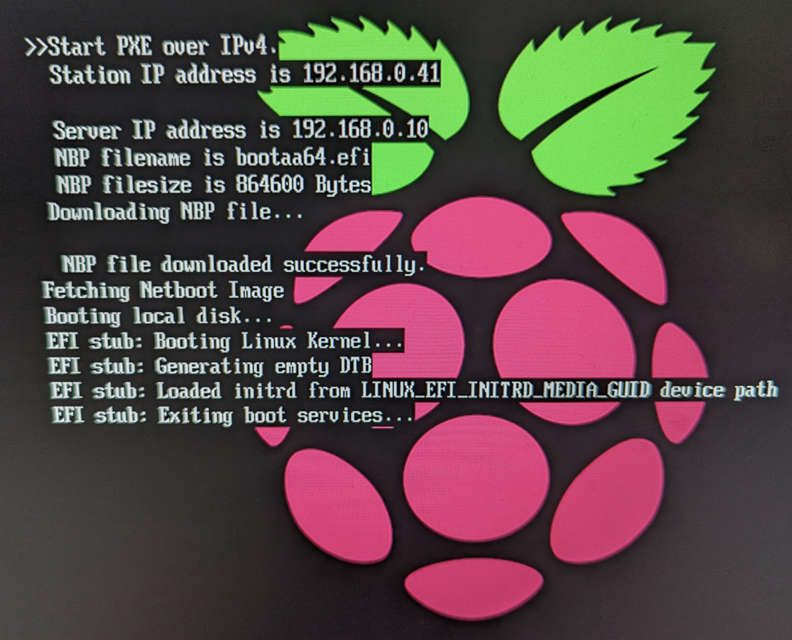

# NOTES on UEFI and Ubuntu for Raspberry Pi

## Intro
The [Bare Metal Bramble Tutorial](https://maas.io/tutorials/build-your-own-bare-metal-cloud-using-a-raspberry-pi-cluster-with-maas#1-overview)
Has us running generic Ubuntu using the UEFI firmware. This works because
UEFI makes the RPI look like a generic machine.

This combination of firmware/OS does not support all RPI hardware. Which would
be OK usually for a K8S cluster since it typically would not have any 
special hardware attached. However when I came to build the Mark II Bramble
I found that PoE Hats' cooling fans would not operate. This is just an
example of a general problem when we want to do 'RPI things' with our RPI
cluster nodes.

This page is notes on investigation around this issue.

# Possible Fixes

What we are doing is never going to be a supported solution because we are using 
UEFI which neither Canonical or RPI Foundation recognize. We need UEFI to get 
PXE boot to work (we think) so there are 4 possible approaches:

1. (unsupported) make the PoE fan device (and others if needed) work on 
   Generic Ubuntu 
1. (unsupported) roll our own image with the RPI version of Ubuntu with UEFI - 
  this going to be some work and 
  could fail due to UEFI incompatibility.
1. ~~(possibly supported?) roll our own image and make it work with 
  EEPROM bootloader !~~
1. Use a different approach for booting that is also supported by MAAS
   I think uboot may come into this category

3 cannot work because with a custom MAAS image you still use their Ephemeral
LTS image to do commissioning. So our boot method needs to be compatible

# Important

This screen does NOT mean that the system has crashed (as I have thought in
the past). It appears to just mean that the console got sent elsewhere, 
probably to serial. So this is a Good boot screen for 22.04 and gives some
small insight into what is happening with DTB, initrd.

Also note that the PXE boot is not required. If you Esc into the UEFI boot and
select boot from USB disk then it starts from 'Booting Linux Kernel'. BUT
note this sets local disk as default and that needs to be deleted to give control
back to MAAS.



# Are UEFI and Ubuntu for Raspberry Pi Compatible?

I think no.

The RPI vs Generic have totally different boot partitions.

```bash
# Generic
ubuntu@pi4:~$ ls /boot/efi -R
/boot/efi:
EFI

/boot/efi/EFI:
BOOT  ubuntu

/boot/efi/EFI/BOOT:
BOOTAA64.EFI  fbaa64.efi  mmaa64.efi

/boot/efi/EFI/ubuntu:
BOOTAA64.CSV  grub.cfg  grubaa64.efi  mmaa64.efi  shimaa64.efi

# ALSO /boot/grub holds grub bootloader

# Raspberry Pi Ubuntu
[giles@ws1 giles]$ ls system-boot/
bcm2710-rpi-2-b.dtb           bcm2711-rpi-cm4.dtb           boot.scr          fixup_cd.dat      start4cd.elf      start.elf
bcm2710-rpi-2-b.dtb.bak       bcm2711-rpi-cm4.dtb.bak       boot.scr.bak      fixup_cd.dat.bak  start4cd.elf.bak  start.elf.bak
bcm2710-rpi-3-b.dtb           bcm2837-rpi-3-a-plus.dtb      cmdline.txt       fixup.dat         start4db.elf      start_x.elf
bcm2710-rpi-3-b.dtb.bak       bcm2837-rpi-3-a-plus.dtb.bak  config.txt        fixup.dat.bak     start4db.elf.bak  start_x.elf.bak
bcm2710-rpi-3-b-plus.dtb      bcm2837-rpi-3-b.dtb           fixup4cd.dat      fixup_db.dat      start4.elf        uboot_rpi_3.bin
bcm2710-rpi-3-b-plus.dtb.bak  bcm2837-rpi-3-b.dtb.bak       fixup4cd.dat.bak  fixup_db.dat.bak  start4.elf.bak    uboot_rpi_3.bin.bak
bcm2710-rpi-cm3.dtb           bcm2837-rpi-3-b-plus.dtb      fixup4.dat        fixup_x.dat       start4x.elf       uboot_rpi_4.bin
bcm2710-rpi-cm3.dtb.bak       bcm2837-rpi-3-b-plus.dtb.bak  fixup4.dat.bak    fixup_x.dat.bak   start4x.elf.bak   uboot_rpi_4.bin.bak
bcm2711-rpi-400.dtb           bcm2837-rpi-cm3-io3.dtb       fixup4db.dat      initrd.img        start_cd.elf      uboot_rpi_arm64.bin
bcm2711-rpi-400.dtb.bak       bcm2837-rpi-cm3-io3.dtb.bak   fixup4db.dat.bak  initrd.img.bak    start_cd.elf.bak  uboot_rpi_arm64.bin.bak
bcm2711-rpi-4-b.dtb           bootcode.bin                  fixup4x.dat       overlays          start_db.elf      vmlinuz
bcm2711-rpi-4-b.dtb.bak       bootcode.bin.bak              fixup4x.dat.bak   README            start_db.elf.bak  vmlinuz.bak

# ALSO overlays folder contains many DTBO
```
This experiment seems to prove it:
- Download Ubuntu for RPI image and burn it to USB
- Boot the USB with no SDCard - all works including PoE Fan
- Reboot with UEFI SDCard in
- Escape into menus and choose boot from /dev/sda
- Nothing happens - returns immediately to the boot menu 

# Making RPI devices Work on Generic
TBA

# Using Uboot with MAAS
TBA
