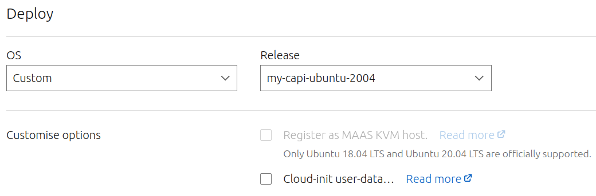

# Build Your Own MAAS Custom Ubuntu Image

**WORK IN PROGRESS**

The K8S Special Interest Groups project [image-builder](https://github.com/kubernetes-sigs/image-builder) 
can build OS images
for all sorts of providers. It is primarily aimed at making secure K8S 
Virtual Machines for cloud services but can be used for bare metal too.

At present it does not support arm architectures. I'm having a stab at fixing 
that.

First I'll make notes on the procedure for rolling your own image for MAAS 
targeting x86. Then we'll get into attempts to make this work for arm64 and
specifically Raspberry Pi.

## Credits
Many thanks are due to Deepak Sharma and Saad Malik of Spectro Cloud who 
helped me get an understanding of this topic. Much of what is presented here
is drawn from their [Cluster API Provider repo](https://github.com/spectrocloud/cluster-api-provider-maas/tree/main/image-generation).

## Sources
- The MAAS documentation page here covers some detail of image generation:
  - https://maas.io/docs/snap/3.1/ui/creating-a-custom-ubuntu-image
- This is the documentation for image-builder
  - https://image-builder.sigs.k8s.io/capi/quickstart.html

# Deploy an Intel Architecture Image

Here we practice with the default ubuntu 20.04 build provided by image-builder.
In later steps we will customize this image. Note that the folder we use 
here is for creating images for use with the ClusterAPI. But the resulting
deployed OS is still useable in the same fashion as a standard ubuntu/focal
deployment.

This procedure will download an official OS image. Boot it into a qemu 
emulator. Run a bunch of Ansible scripts to harden the OS,
configure and install everything 
required by the Cluster API to stand up a cluster node.
These include:
  - TODO

At the end of this we have a qcow2 format virtual machine image. We then
mount the image into the filesystem and tar up its contents. This tarred
file can then be sent to MAAS as a custom image.

## Build the Virtual Image

```bash
# These steps should all be performed on an 64bit Intel Workstation

# install KVM for accelerating emulation 
sudo apt-get install qemu-kvm libvirt-daemon-system libvirt-clients bridge-utils

# get the repo
git clone git@github.com:kubernetes-sigs/image-builder.git
cd image-builder/images/capi
make help

# make sure required tools are (user) installed (packer, ansible, goss)
make validate-qemu-ubuntu-2004-efi

# start he image buildbase
make qemu-ubuntu-2004-efi
```

If all is well, after 10 minutes or so you should see:
```
Build 'qemu' finished after 10 minutes 11 seconds.

==> Wait completed after 10 minutes 11 seconds

==> Builds finished. The artifacts of successful builds are:
--> qemu: VM files in directory: ./output/ubuntu-2004-kube-v1.21.10
```

## Tar up the Virtual Image Filesystem
We now have an installed virtual machine in ./output/ubuntu-2004-kube-v1.21.10
To turn this into a zipped up filesystem we mount the virtual image using
qemu-nbd and then tar up the resulting filesystem. I've done these steps
in the script tar-vm.sh. To run:

```
cd image-builder/images/capi
curl -O https://raw.githubusercontent.com/gilesknap/IaC-at-home/main/imagebuild/tar-vm.sh
bash tar-vm.sh ./output/ubuntu-2004-kube-v1.21.10/ubuntu-2004-kube-v1.21.10

# this will create the tar file
# ./output/ubuntu-2004-kube-v1.21.10/ubuntu-2004-kube-v1.21.10.tar.xz
```

## Deploy The Custom Image using MAAS
Now you can add your new image to MAAS
```bash
# scp the image file to your maas sever, or cp to a shared filesystem e.g.
cp ./output/ubuntu-2004-kube-v1.21.10/ubuntu-2004-kube-v1.21.10 /mnt/config/maas

# go to your maas server e.g.
ssh vmaas1
# add your image to maas. Here I'm using the default profile 'admin'
maas admin boot-resources create name=custom/my-capi-ubuntu-2004 architecture=amd64/generic base_image=ubuntu/focal content@=image2.tar.gz
```

Finally release one of your x86 machines and try out the deployment.
Choose the following options after selecting the Deploy Action. I found that
this completed deployment but reported an error on first boot. I think the issue 
is that we need to provide some curtin config. However the resulting OS
works and shows as deployed and can be ssh'ed to as normal.

```
# no password required.
ssh ubuntu@<my_new_machine_name_or_ip>
```




# Customize The ubuntu-2004-kube-v1.21.10 Image

We have two places to customize what this image will look like.
- The packer configuration determines what packer puts into the static virtual image
- Ansible scripts determine what gets run inside the VM once it boots

imagebuilder is designed to be extensible by adding extra config files (as 
opposed to editing its config files)

TODOS
- Get the disk partitions down to 1
- Use a 21.04 candidate as the base OS (or at least one that has a good enough kernel for RPI)
- fix the curtin problem: need more understanding of this - but see /curtin/curtin-hooks
  [In this page](https://maas.io/docs/snap/3.1/ui/creating-a-custom-ubuntu-image) 
  (maybe we did get curtin to run since the networking is OK - but it did error)
- Make this whole thing work for RPI (hope to use official RPI base image)
  - [Started making notes on progress here](../packer/README.md)


