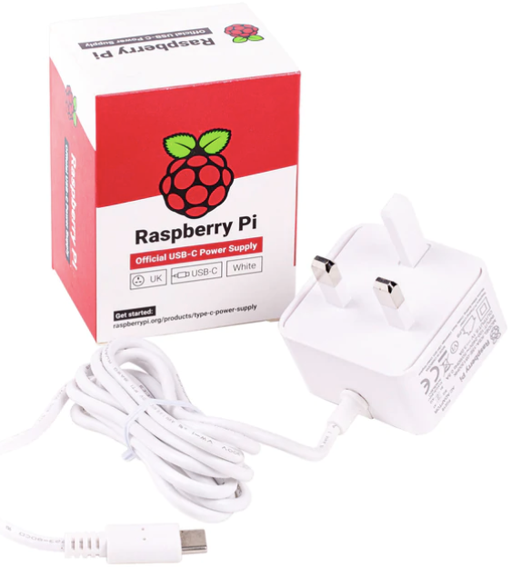
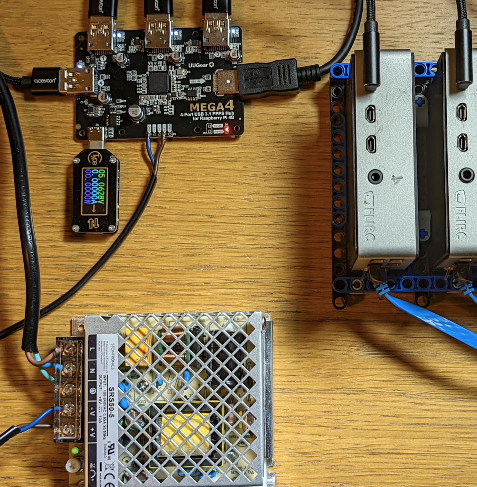
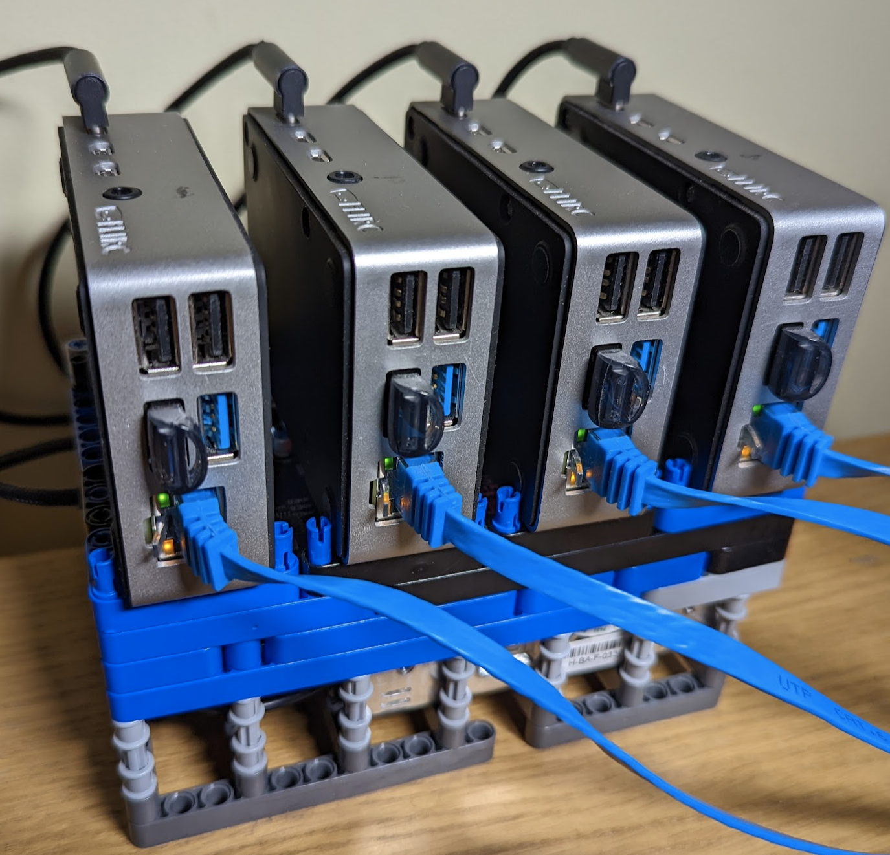

# Investigating the Power Supply to use with UUGear MEGA4

# Summary

With the UUGear 4 Port PPS you must supply additional power via the USB C 
connection, or power rails. You will find that RPIs will under voltage throttle
if there are too many of them for the power supply.
- 2 RPIs are supported by the Official RPI USB C 15W supply
- 3 RPIs could be supported by a 5V 5A supply with a usb C conversion plug. This 
  must be 'dumb' and not use Power Delivery Protocol. It must also be a 
  well regulated supply that maintains voltage under load - the one I tried 
  only supported 2 RPIs
- 4 RPIs could be supported by soldering a 5V 10A supply to the power rail headers.
  Again a well regulated supply is required.

# Details of research
I got this useful info from UUGear:

---
**Email from UUGear**

Hello,

MEGA4 doesn’t have PD chip on board and it can not negotiate with PD USBC power supply for bigger current. Also, those PD USBC power supplies usually offer higher power by increasing voltage (to 9V or 12V), which is not acceptable for MEGA4.

A “dumb” USB power supply with higher power can be an option. You make your own USBC power supply, or change an existing power supply’s output plug to USBC, however please be reminded the USBC connector is rated at 5A, so it is better not to exceed 25W.

You can also solder a power supply to the 5V power rail (to 5V and GND in pin header), and there is 2.5A current limit for each port, so 10A max. This way you can connect 50W power supply to it.

Best Regards,
Tanya

---

## Official Raspberry Pi 3A supply

I tested this supply with the same approach as below for the 5A supply.
This performed just as well as the 5A supply, happily running 2 RPIs but
seeing throttling when a 3rd RPI is added.

Therefore this is the ideal option if you don't want to do any soldering. If 
you wish to support more than 2 RPIs per UUGear MEGA4 then soldering will
be required. Or potentially a better regulated 5V 5A supply would suffice.




## 25W Through USBC

----
**TLDR**

Not recommended, only performs as well as the cheaper and simpler
Official Raspberry Pi USB V Power Supply.

NOTE: This result not make sense from the specs. A better regulated 5A power supply 
should be able to run 3 RPIs.

----

I'm hoping that 25W into the USB C with a dumb power supply would do the trick
this is because I have read 
[here](https://uni.hi.is/helmut/2021/06/07/power-consumption-of-raspberry-pi-4-versus-intel-j4105-system/#:~:text=The%20Raspberry%20Pi%204%20consumed,5.4%20W%20and%205.5%20W.)
that the RASPI only draws 6W under stress
(with no peripherals connected)

So I bought these:
- https://www.amazon.co.uk/gp/product/B07XZ7Q2N7/
- https://www.amazon.co.uk/gp/product/B09JS8N331/

And plugged in to UUGEAR USB C.

To test I wanted to use the command `vcgencmd get_throttled` I was unable to
get this working on the ubuntu install despite vcgencmd being in an official
package. So I booted 1 of my PIs with a raspi OS and ran a watch window

```
Every 2.0s: vcgencmd get_throttled raspberrypi: Sat Feb 26 19:34:31 2022

throttled=0x50000

```

0x50000 means that there has been a throttling
0x50005 means we are throttling now due to low voltage.

I ran stress on all Pis including the one measuring throttling
```
sudo apt install stress
stress --cpu 4
```

This test shows that 2 PIS can be supported by this power supply at full
cpu usage. A third PI not even running stress, causes us to start seeing
under voltage throttling.

## 50w Supply wired to power rails

Next I am ordering one of these (very similar are available on Amazon with 
a slightly better price, but I chose the official RS model since my
experience with the 25w supply was sub-par)
- https://uk.rs-online.com/web/p/embedded-switch-mode-power-supplies-smps/1618278


This will be soldered to the power rail headers, pins GND and 5V shown here:


This will also need an enclosure or other way of hiding exposed terminals.

The results with this supply were a success. It has a voltage control pot 
which lets you tune the voltage. It is safe to raise the voltage to
5.1 volts and as long as it does not dip below 4.9 volts the RPIs should
not throttle.

## 4 RPIs connected to MEGA4 with > 5v sustained




## Final Setup with custom Rack





