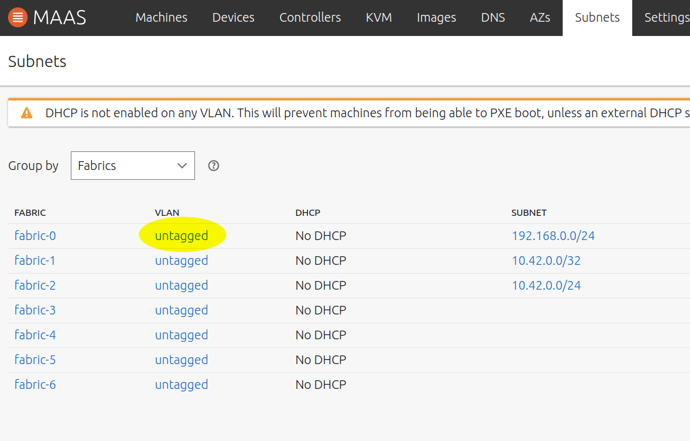

# MAAS allows us to provision an OS on bare metal

I used these resources

- https://thenewstack.io/provision-bare-metal-kubernetes-with-the-cluster-api/
- https://maas.io/docs/snap/3.1/ui/maas-installation?utm_source=thenewstack&utm_medium=website&utm_campaign=platform
- https://discourse.maas.io/t/raspberry-pi-4-provisioning-and-kvm-pod-setup/3607
- https://github.com/pftf/RPi4

A great place to put the MAAS and management cluster is in a VM on the NAS. 
This can then be backed up easily with facilities in QNAP Virtualization Station.

Using https://www.qnap.com/en-uk/software/virtualization-station I have 
created an Ubuntu 20.04 Server VM called gkvm.

This machine will become the DHCP Server so will require a fixed IP.
https://www.linuxtechi.com/assign-static-ip-address-ubuntu-20-04-lts/

You will need to generate an SSH key and configure it for GitHub access:
```bash
ssh-keygen 
cat .ssh/id_rsa.pub
# now go to https://github.com/settings/keys and add this public key 
```

Now install Canonical's MASS:
```bash
# install MAAS
sudo snap install --channel=3.0/stable maas

# install a postgres DB with MAAS-ready database instantiation
sudo snap install maas-test-db
# install both the region and rack locally (accept default MAAS URL)
sudo maas init region+rack --database-uri maas-test-db:///
# setup a local account for MAAS admin 
# When asked for 'Import SSH keys' use gh:<your github account (not email)>)
sudo maas createadmin
```
if the SSH import fails you can complete this below

Now the Web UI should be accessible at `http://gkvm:5240/MAAS/` substitute the name or IP of your VM.

- login with the admin account set up above
- pick the architectures of your target machines
- IF the SSH import above failed:
  - provide your github ID (not email) to import the github SSH keys
  - for the above to work you must have added your public id key to github

Select the distros you want to install.

Now enable DHCP on your subnet. Make sure you disable the existing DHCP first.
Goto the subnets tab, select the VLAN of your subnet, give it a name and 
click enable DHCP



# Commission and Deploy your machines

Detailed instructions for deploying the Raspberry Pi are
[here](RaspiMASS.md). Deploying to an Intel NUC was almost identical,
except that configuring PXE boot is just a matter of going into UEFI
settings.

IMPORTANT: if MAAS has a disk listed in 'Used disks and partitions' then
it will remove the partition table on that disk. If you want to keep the
contents of the disk, have MAAS ignore it by removing it from the list.

REMINDER: to bring up a disk with single partition after it has been
trashed by MAAS (e.g. for /dev/sdb):
```bash
lsblk
# list the disks and you will see a disk with no partitions e.g. /dev/sdb 
# with no /dev/sdb1 partition associated
sudo fdisk /dev/sdb1
# commands d g n w and accept defaults (first d if there is existing partition to delete)
sudo mkfs -t ext4 /dev/sdb1
sudo blkid
# find the UUID and and add this to /etc/fstab
sudo vim /etc/fstab
# UUID=70ad2e88-a8d3-40f1-a4f9-55a64d71607c /mnt/bigdisk_archive  ext4  defaults 0 1
sudo mkdir /mnt/bigdisk_archive # maybe change permissions on this folder 
sudo mount /mnt/bigdisk_archive 
```

# Log in to the CLI

```bash
sudo maas apikey --username admin
maas login admin http://localhost:5240/MAAS

# see all the stuff you can now do!
mass admin --help
```

Assuming the machine you are on has the private key for one of your github
ssh keys then you can 
ssh ubuntu@192.168.0.43
