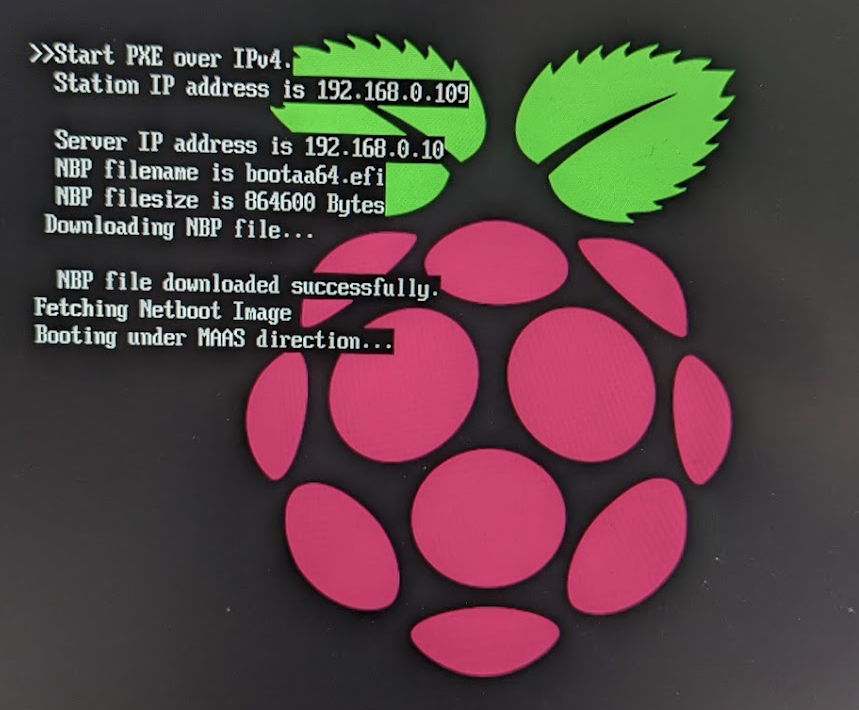
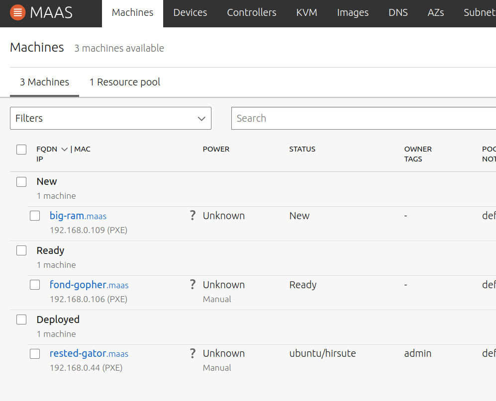
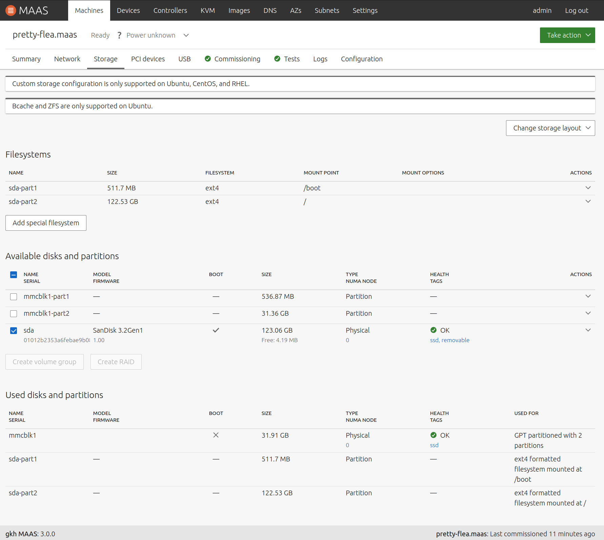
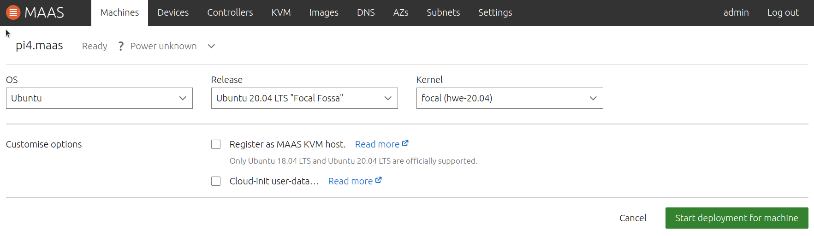
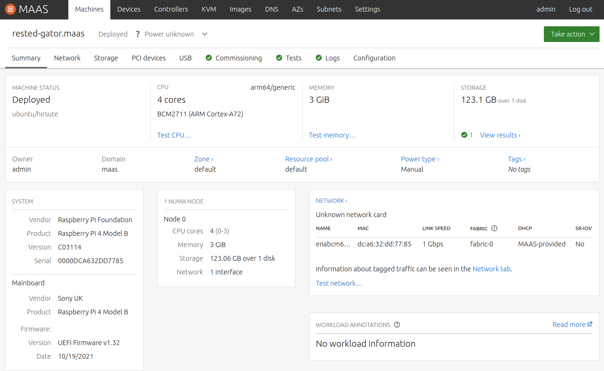

# Commissioning Raspberry Pi 4 with Canonical MAAS

These steps were successful in commissioning a few Raspberry Pi 4 with 
4 GB of RAM. I used an SD Card for UEFI and a USB3 drive (32GB thumbdrive) 
for OS install.

# Install MAAS
First install Canonical's MAAS as per the instructions here:

- https://maas.io/docs/snap/3.0/ui/maas-installation?utm_source=thenewstack&utm_medium=website&utm_campaign=platform

During the above you will select the images to use. See below for which 
images to select.

At present (Feb 2022) during the selection of Ubuntu images will include the 
latest LTS 20.04.  Only LTS versions are allowed for Commissioning, but you may 
deploy other versions. I chose to use LTS 20.04 for deployment, I also tried
21.10 but this had intermittent failures.

20.04 default kernel will not work with Pis. To fix this issue go to the MAAS Web GUI
and choose `Settings->Configuration->Commissioning` and set Default minimum 
kernel version to focal (hwe-20.04).

If you use 20.04 for deployment, you must then select the hwe kernel at 
deploy time too. Alternatively use a more recent version that has a kernel version
`>=5.8`. To configure which is the default deployment version go to 
`Settings->Configuration->Deploy` in the MAAS Web GUI.

Before proceeding, ensure that you have selected and sychronised the ARM64 20.04 LTS image under the images tab.

# Setup the Pi to PXE boot

Now we need to create an SD card that boots the UEFI firware. This supports 
PXE Boot.

See [Make UEFI SD Card](MakeUefiSd.md)

Once you reboot with PXE enabled you should see this screen

# Commission and Deploy

Go back to the MAAS GUI and choose the Machines Tab. 

All being well your Pi Should appear under the 'New' group like 'big-ram' below.
MAAS has already run the commissioning step when the new machine PXE booted.
You are still required to run the test phase before moving on to deployment.
Note that if you make any changes to the hardware after deployment, you will
need to release, commission, deploy again.

You can now click on the new machine and see a summary. 
Go to the machine Configuration Tab an set Power Configuration to Manual. 
Use the Take Action button to choose the Test command. 

~~IMPORTANT: Select the tick box 'Allow SSH access and prevent machine powering off'~~

You will now need to manually power cycle the Pi to kick off this process.

Note that if you are seeing the console output of the machine then you will see
`reached cloud init target`. When you see this and MAAS UI shows status 'Ready'
you should power cycle the machine. Clearly this would be smoother if some
kind of remote power was added to the setup.

You can now watch progress in the Logs tab. When you see the this message,
It is time to do another power cycle. Eventually you should see the logs say:

- Node changed status - From 'Testing' to 'Ready'

If you move straight to deploying now then MAAS will try to put Ubuntu on 
The SD Card, it will fail and the Pi won't reboot since UEFI has been overwritten.
So first go to the Storage tab for your machine. And do the following:

- Filesystems:~~unmount~~ REMOVE both filesystems on the sd card
- Available disks and partitions: remove physical disk of the sdcard
- Change Storage Layout: Flat
- make sure all sd card partitions appear in the AVAILABLE section
- TODO - would simply selecting Flat work (as I think it may remove 
  the SD filesystems anyway)

You are now ready to deploy  your Pi. This will install the OS onto the
USB disk.
Choose Take Action -> Deploy. If you are installing 20.04 make sure 
you choose the hwe version of the kernel. You should see the choice at the
top of the screen like this.

Make sure you select 'Allow SSH access and prevent machine powering off'
You will need a power cycle to kick off the deployment .
Continue to watch the logs and you will eventually see:

- Node changed status - From 'Ready' to 'Deployed'

You are good to go. Note that you can ssh into the newly deployed machine 
using:

- ssh ubuntu@machine-name

Assuming your identity is one of you github SSH keys then you should 
be admitted.

Below is an example summary screen for a deployed Raspberry Pi.

# Power Control

To make this truly MAAS we require the addition of remote power control
of the machines. See https://github.com/gilesknap/maaspower

The maaspower controlled device I selected is the UUGear Mega4. To supply
enough power to this device to run all your RPIs see [here](PowerSupply.md)

