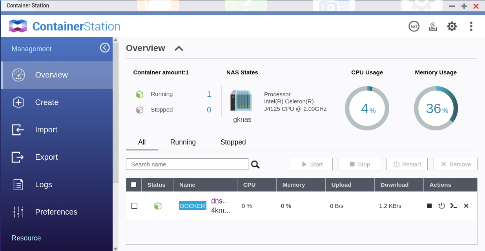

# Dnsmasq

This is inserted between the LAN and the upstream DNS servers. For the 
purposes of this exercise it allows us to:

- Create DNS records local devices on the LAN
- Create a local DNS Domain for your devices
- Provide PXE boot. This lets machines on the LAN to boot from the network
  and install an OS
  
## Install on the NAS

# create a dnsmasq container
- Use App Centre to install ContainerStation
- Create a shared folder called config with manual path /config
- potentially DHCP server (I don't use this)

  - add a subfolder dnsmasq
  - copy in the file dnsmasq.conf to the subfolder
  - edit the conf file to match your DNS config
  - create the file /config/dnsmasq/local_hosts with etc/hosts entries
- In Container Station pull the image 4km3/dnsmasq (pick a new stable tag
  don't use 'latest')
- Create a new container with:
    
    - image: 4km3/dnsmasq
    - entrypoint: /usr/sbin/dnsmasq -k --conf-file=/config/dnsmasq.conf
    - Advanced Settings

      - network: choose a fixed address outside of your DHCP
      - shared folder: /config -> /config/dnsmasq read/write
- Start the container and set it to auto start
- Verify it is working 

  - launch a console (with /bin/sh) with the '>_' button
  - cat /config/dnsmasq.conf
  - from the workstation try to telnet to port 53 on the IP you chose. 

# enable as the DNS server

Now point at the IP configured above for DNS resolution. This is usually 
a configuration change to your DHCP server.

NOTE: I had more success with changing /etc/resolve.conf on each machine
this made the local_hosts file work. Maybe this is a good idea because then
I can take down the NAS without killing my household internet (just kill
the cluster).
TODO: investigate best practice on the above.

Verify that you can ping the local names configured in the dnsmasq.conf
(and still see the internet!)

